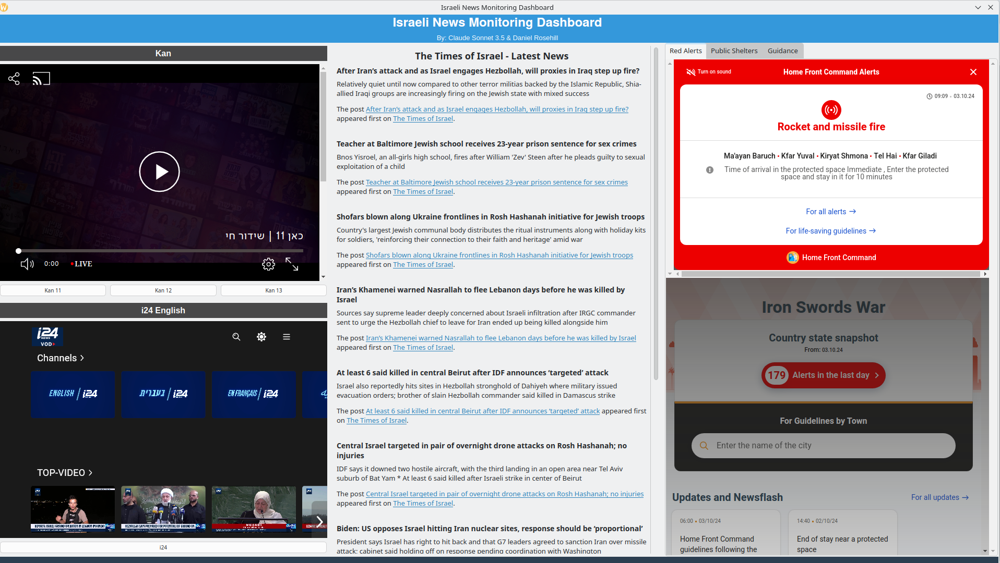

# Israel News Monitoring Dashboard Project - 131024

By: Daniel Rosehill
Jerusalem
13-10-24

*Originally written as a prompt to GPT!*

Please help me to spec out the following project which I've been working on as a side project for my own use over the past couple of weeks. I'll described what I'm trying to create and some of the obstacles I've encountered. While I've frequently felt like giving up on this idea, equally I believe that it would be an important resource.

## Outline

I'd like to build a news monitoring dashboard for the benefit of those who (like me) live in Israel. While the government provides an excellent alert system, by the time alarms go off it's often too late to find ideal shelter and the alert time is at best only a few minutes. The recent Iranian attack drove home for me the need to remain vigilant about following news updates during certain times.

### Why a dashboard and why non-interactive?

Many observant Jews avoid using electricity during religious holidays although that doesn't preclude them from viewing displays non-interactively (if they so choose).

While I usually relish weekly periods of disconnect from digital devices, in the current geopolitical climate I'm not comfortable with completely avoiding updates. I have heard from quite a few others with similar concerns. But currently it's not easy to create a unified view of key news sources.

### My Early Prototypes

I've already done quite a bit of work in speccing out the dashboard and I've created a few prototypes both as web UIs and local Python programs. 

Here's an early version:

I picked up a cheap Android table and display to display it:

### Basic Dashboard Information Views

As shown below:

1: Basic Red Alert feed
2: Combined RSS feed 1 (English Israel-based news sources)
3: Local time and time in UTC
4: Combined RSS feed 2 (Hebrew language news)

Not shown:

Combined RSS feed showing foreign media and newswires.

### Key News Sources

These are the URLs that are the most important for this purpose:

**Pikud HaOref Alerts**
[Link](https://www.oref.org.il/eng/alerts-history)
This is the official alerts feed from the Israel Home Front Command (Pikud HaOref) which is responsible for civilian preparedness

**Kan News Live**
[Link](https://www.kan.org.il/live/)
Live news TV stream from Kan (Channel 11) broadcasting in Hebrew

**i24 News**
[Link](https://video.i24news.tv/live/brightcove/en)
i24 live news feed in English

### Supplementary 

I think that it's vital that the dashboard be accessible from every device and operating system so that less technical users don't need to install anything to access it as intended. Clearly, both the news alerts and the Pikud HaOref feeds would need to run as background processes within the tab. For this reason, I think that a web UI is the most obvious way to create this.

I would love to create and operate this dashboard as a public good provided that I could create a sufficiently strong disclaimer. In addition to the dashboard itself, I'd like to add some simple instructions on how to use it. For example, I might provide links to a kiosk mode browser on Android, emphasize the importance of setting your city in the Pikud HaOref app and testing the alerts, and provide instructions for how to disable power management settings on various OSes that might interfere with the dashboard's continuous display. Finally, I'd like to integrate an element to the dashboard to validate that it's operating perfectly. To date, I've done this using a time display.

Now let me list the technical challenges:

1: The Pikud Haoref alerts page can be embedded but it's georestricted to Israel. As many third party dashboard builders use non Israeli IPs, this means that the widget often won't display even when connecting from Israel. There are third party tools but they have their own challenges with responsive design.

2:While the dashboard merely syndicates information that is in the public domain, if it were a publicly available resource, it faces a high likelihood of being subjected to DDoS attacks.

