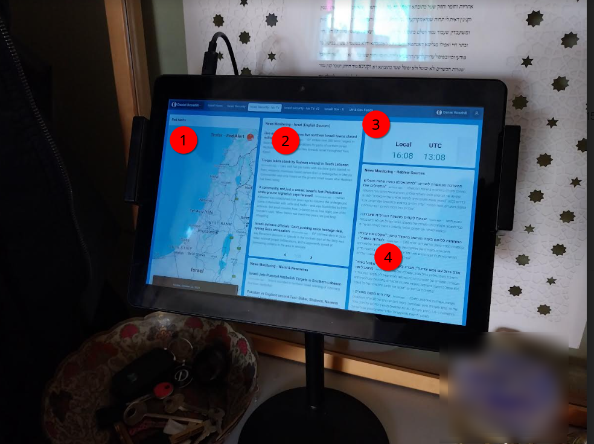

# Israel News Monitoring Dashboard Project - 131024

By: Daniel Rosehill
Jerusalem
13-10-24

*Originally written as a prompt to GPT!*

Please help me to spec out the following project which I've been working on as a side project for my own use over the past couple of weeks. I'll described what I'm trying to create and some of the obstacles I've encountered. While I've frequently felt like giving up on this idea, equally I believe that it would be an important resource.

## Outline

I'd like to build a news monitoring dashboard for the benefit of those who (like me) live in Israel. While the government provides an excellent alert system, by the time alarms go off it's often too late to find ideal shelter and the alert time is at best only a few minutes. The recent Iranian attack drove home for me the need to remain vigilant about following news updates during certain times.

### Why a dashboard and why non-interactive?

Many observant Jews avoid using electricity during religious holidays although that doesn't preclude them from viewing displays non-interactively (if they so choose).

While I usually relish weekly periods of disconnect from digital devices, in the current geopolitical climate I'm not comfortable with completely avoiding updates. I have heard from quite a few others with similar concerns. But currently it's not easy to create a unified view of key news sources.

### Early Prototypes

I've already done quite a bit of work in speccing out the dashboard and I've created a few prototypes both as web UIs and local Python programs. 

Here's an early version:

I picked up a cheap Android table and display to display it:

### Basic Dashboard Information Views

As shown below:

1: Basic Red Alert feed
2: Combined RSS feed 1 (English Israel-based news sources)
3: Local time and time in UTC
4: Combined RSS feed 2 (Hebrew language news)

Not shown:

Combined RSS feed showing foreign media and newswires.

### Key News Sources

These are the URLs that are the most important for this purpose:

**Pikud HaOref Alerts**
[Link](https://www.oref.org.il/eng/alerts-history)
This is the official alerts feed from the Israel Home Front Command (Pikud HaOref) which is responsible for civilian preparedness

**Kan News Live**
[Link](https://www.kan.org.il/live/)
Live news TV stream from Kan (Channel 11) broadcasting in Hebrew

**i24 News**
[Link](https://video.i24news.tv/live/brightcove/en)
i24 live news feed in English

### Supplementary Links

See `Data-Sources`, specifically `Israel-News-Links` for information sources that can be added to enrich the news feed.

News links are also aggregated into a separate repository [here](https://github.com/danielrosehill/Israeli-News-Links).

## Plans

- Dashboard available as a publicly accessible web UI with a variety of pre-built dashboards designed to cater for various preferences. One dashboard might feature news feeds and live TV. While another might feature only news feeds. All would integrate red alerts. 

## Additions

- Documentation as a page within the dashboard providing basic information on how to configure the dashboard on various OSes (disabling power management, automatic screen timeoffs etc). Additionally, links to various apps that are useful for showing the dashboard on mobile devices (Android kiosk mode browsers, etc)

## Challenges

- Utilising news sources that have public value but which may have licensing and/or access restrictions.
- If the dashboard is made available as a public resource, the infrastructure is a likely attack surface for hacking

