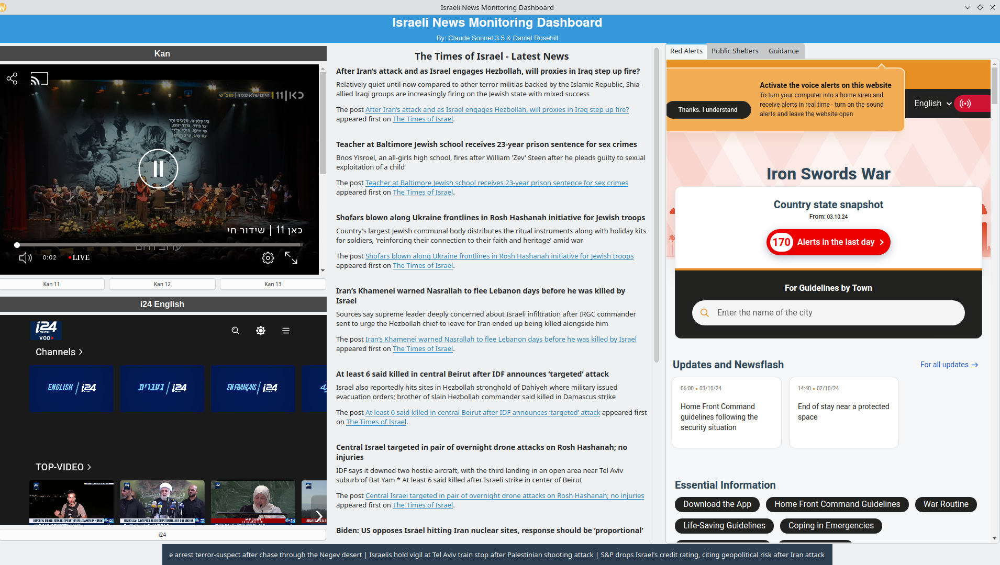

# Israel News Montitoring Dashboard

 

## Purpose Statement

For those staying up to date with developments in Israel during geopolitically sensitive times.

## Notes On Copyright

This utility was created for the benefit of English speakers living in Israel and wishing to keep appraised of ongoing geopolitical developments with a "bird's eye" news monitoring type interface. 

Kan (Israel's state broadcaster) is free to air in Israel. The Red Alert system will not display results without an Israeli IP.

If you don't live in Israel and are just interested in following the news - this is not the tool for you!

## Author

Daniel Rosehill  
(public at danielrosehill dot com)

## Licensing

This repository is licensed under CC-BY-4.0 (Attribution 4.0 International) 
[License](https://creativecommons.org/licenses/by/4.0/)

### Summary of the License
The Creative Commons Attribution 4.0 International (CC BY 4.0) license allows others to:
- **Share**: Copy and redistribute the material in any medium or format.
- **Adapt**: Remix, transform, and build upon the material for any purpose, even commercially.

The licensor cannot revoke these freedoms as long as you follow the license terms.

#### License Terms
- **Attribution**: You must give appropriate credit, provide a link to the license, and indicate if changes were made. You may do so in any reasonable manner, but not in any way that suggests the licensor endorses you or your use.
- **No additional restrictions**: You may not apply legal terms or technological measures that legally restrict others from doing anything the license permits.

For the full legal code, please visit the [Creative Commons website](https://creativecommons.org/licenses/by/4.0/legalcode).